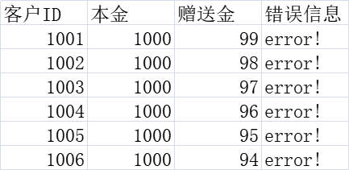

# Excel Util

SpringBoot 表格导入举例

```http request
### 上传
POST http://localhost:8080/excel/upload
Content-Type: multipart/form-data;


### 下载
GET http://localhost:8080/test/excel/download
```

excel example:


